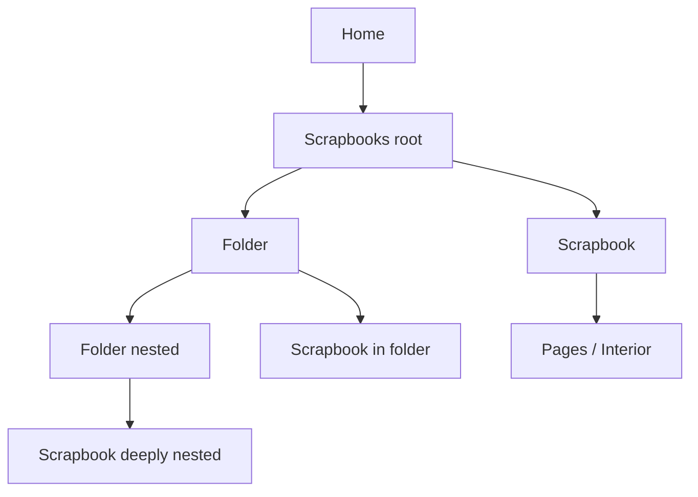

# Journeybook — Design Spec (v0)

> **Note:** This is the visual/design reference for the first slice. The product
> and technical source of truth is now [`../SPEC.md`](../SPEC.md), which
> supersedes this document where the two disagree.

Scope of this document: the first design slice — **Home**, the **Scrapbook
organizer**, and a **scrapbook interior**. It is a mockup spec, not final
implementation. Review notes are welcome inline.

## 1. Product framing

Journeybook is a private memory-keeping space for exactly two people. This slice
covers scrapbooking: creating nests of folders and scrapbooks, and filling a
scrapbook with pages of photos, notes, and stickers.

Guiding feeling: **a cozy cottage scrapbook** — warm paper, soft light, tiny
tactile details (washi tape, pressed flowers, doilies), a little trodden-in
personality. Artsy and handmade, not glossy or corporate.

## 2. Navigation map

```
Home
└─ Scrapbooks (organizer, root)
   ├─ Folder ──▶ Folder (nested) ──▶ Scrapbook
   └─ Scrapbook ──▶ Interior (pages)
```

- Home: one hero object ("Scrapbooks") on a shelf. Room for more objects later
  (Notes, Games, Camera) shown as faded "coming soon" pills.
- Organizer: browse the tree of folders and scrapbooks; create, rename, delete,
  search.
- Interior: view and fill the pages of a scrapbook.

Below is a Mermaid view of the same tree for quick reference:



## 3. Data model (proposed)

The tree is stored as a flat list of nodes with a `parentId`, which keeps
nesting trivial and ports cleanly to PocketBase collections later.

```ts
type NodeType = 'folder' | 'scrapbook';

interface Node {
  id: string;
  type: NodeType;
  title: string;
  parentId: string | null; // null = root
  tags: string[];          // reserved for cross-tree search (later)
  order: number;           // manual ordering within a parent
  cover?: CoverColor;      // scrapbooks only
  pages?: Page[];          // scrapbooks only
  createdAt: string;
  updatedAt: string;
}

type CoverColor = 'rose' | 'sage' | 'mustard' | 'terracotta' | 'sky' | 'kraft';

interface Page {
  id: string;
  elements: Element[]; // photos, notes, stickers
}

type Element =
  | { kind: 'photo'; photo: PhotoStyle; caption?: string; rot?: number }
  | { kind: 'note'; text: string; rot?: number }
  | { kind: 'sticker'; icon: 'heart' | 'star' | 'sparkle'; rot?: number };
```

Rules:

- A folder may contain both folders and scrapbooks, nested to any depth.
- A scrapbook lives in exactly one place (one `parentId`). Tags are how a book
  will later surface across the whole tree; they are **not** a second home.
- Ordering is explicit via `order`, so drag-to-rearrange can arrive later.

## 4. Screens & interactions

### 4.0 Room shell (persistent)

Every screen lives inside one illustrated room, fixed behind and around a
scrolling content column, so the whole app feels like one place:

- **Background**: striped wallpaper wall over a plank wood floor, with a
  baseboard and a soft vignette.
- **Wall decor**: a window (sky, sun, clouds) flanked by linen curtains, string
  lights across the top, a live wall clock (the pink hour hand is Central time,
  the blue hour hand is Eastern; the dark hand is the shared minute hand), a
  trinket shelf, and a corkboard of pinned postcards.
- **Foreground floor**: a 3D wooden desk on the left with a raised backsplash,
  holding our desk things — an open silver laptop, a mug with rising steam, a
  pencil cup full of pens at different angles, a pair of scissors, a blue Owala
  bottle with stickers, and a plant — a rug in the middle, and a bean bag chair
  on the right where our raccoon naps (with little "z"s). Every item sits on the
  same desk surface but at a different spacing and height, and at slightly
  irregular angles rather than evenly lined up.
- **Mobile**: the desk and bean bag keep their size. The desk is centered and
  pushed up against the wall; the bean bag sits in front of it, lower on the
  screen, so the raccoon overlaps the desk's base.
- **Top room bar**: "our little room" (the home icon is a button that returns to
  Home), the next-visit countdown, and the two of us (avatars).
- **Content area**: fixed to the viewport height and never scrolls below the back
  of the desk, so there is no vertical page scroll. The organizer lays its items
  in up to two rows that scroll horizontally; when there is more to see, little
  arrowheads appear beside the items (no scrollbar). The desk and bean bag stay
  put in the foreground.
- **Ambient motion** (disabled under `prefers-reduced-motion`): twinkling lights,
  curtain sway, a breathing raccoon, drifting dust motes, rising steam.

### 4.1 Home

- Cozy shelf scene: hero scrapbook object, string lights, potted plant, mug.
- Hero click → organizer root.
- Faded "coming soon" pills: Notes, Games, Camera (not interactive yet).
- Extensibility: future features become additional shelf objects; the shelf
  layout should gracefully accept more.

### 4.2 Organizer

- **Title**: the current folder's pink washi-tape crumb is the title; there is no
  separate large heading (the two would be redundant).
- **Breadcrumb**: washi-tape trail from "Scrapbooks" down to the current folder.
  Every crumb is clickable.
- **Contents**: folders render as manila folders (with a peek of paper and an
  item count); scrapbooks render as covered books (with a page count), laid out
  in up to two rows read left-to-right.
- **Toolbar**: "New folder" and "New scrapbook" stay pinned above the items while
  the items scroll.
- **Scrolling**: arrowheads on the left/right appear only when there are more
  items in that direction; they scroll the items while the toolbar stays put.
- **Create**: choosing a type reveals an inline form card as the first item;
  Enter or "Create" makes the node inside the current folder.
- **Open**: click a folder to drill in; click a scrapbook to open its interior.
- **Per-item menu** (hover/focus): Rename, Delete. Folders delete with their
  contents.
- **Empty state**: hand-drawn invitation to make the first folder/scrapbook.
- **Home**: the home icon in the top room bar returns Home; breadcrumbs navigate
  within the tree.

### 4.3 Interior

- Title is the pink tag beside the back button (no duplicate large heading).
- Open-book spread showing two consecutive pages on desktop; on mobile, one page
  at a time, with page-based navigation and a "page X of N" label.
- Elements: polaroid photos with tape, handwritten sticky notes, doodle stickers.
- **Page nav**: prev/next spread, with a "pages X–Y of N" label.
- **Add**: Add photo / Add note / Add sticker append to the current page.
- **Back**: returns to the parent folder in the organizer.

## 5. Design tokens

| Token | Value | Use |
| --- | --- | --- |
| `--paper` | `#f7efdd` | page background base |
| `--card` | `#fcf7ec` | cards, buttons |
| `--ink` | `#4a3b2e` | primary text |
| `--ink-2` | `#6f5c49` | secondary text |
| `--kraft` | `#d3b184` | folders |
| `--rose` | `#d98c8c` | primary accent, book cover |
| `--sage` | `#9caf88` | secondary accent |
| `--mustard` | `#d9a94e` | search highlight, warm accent |
| `--terracotta` | `#c97b5a` | warm accent |
| `--sky` | `#9dbfc9` | cool accent |

- **Type**: `Fraunces` (cozy serif headings), `Caveat` (handwriting accents),
  `Nunito` (body).
- **Texture**: paper grain overlay, torn/stitched borders, washi tape,
  paper clip, pressed flowers.
- **Motion**: subtle lift on hover, near-zero rotations for a hand-placed feel.
- **Shadows**: warm, low-contrast, like objects resting on a desk.

## 6. Accessibility

- Body copy stays in a readable sans (`Nunito`) at comfortable sizes; hands
  (`Caveat`) are accents only, never long-form.
- Text contrast checked against paper backgrounds; interactive elements get a
  visible `:focus-visible` outline.
- Tap targets ≥ 44px on mobile; tiles are keyboard-activatable.
- Decorative art is `aria-hidden`; meaningful art carries a label.

## 7. Art assets

All art lives in `design/assets/svg/`, one asset per file, per the repo
constitution. Current set:

- Paper & craft: paper grain, washi tape, paperclip, polaroid placeholder,
  scissors, pencil cup, laptop, owala bottle, corkboard.
- Nature & cozy: potted plant, pressed flower, mug, corner flower, string
  lights, window, curtain, wall clock, wall shelf, rug, wallpaper stripes,
  desk, bean bag, sleeping raccoon.
- Doodles: heart, star, sparkle.
- UI icons: folder, book, search, back, plus, menu, close, chevrons, home,
  pencil, trash, camera.

## 8. Open questions

- Manual drag-to-reorder vs. sort by name/date — defer.
- Tags UI for cross-tree search — data model reserved, UI not designed.
- Shared vs. per-user private books — depends on the auth model.
- Interior page model: is a page a fixed spread, or freeform canvas? Mockup
  assumes a simple vertical flow for now.
- Real photo upload / storage flow (PocketBase files) — not in this slice.
